# AWS Architecture Examples

This page demonstrates real-world AWS architecture diagrams using Mermaid's `architecture-beta` syntax with embedded Iconify icon packs — no CDN, no image files.

> All icons are from the `logos:*` pack (tech company logos) bundled at build time.

---

## Web Application — Three-Tier

A classic three-tier web application with load balancer, application servers, and a managed database.

---

## Serverless Data Pipeline

A fully serverless event-driven data pipeline using AWS Lambda, SQS, DynamoDB, and S3.

---

## Microservices on ECS Fargate

Containerised microservices running on AWS ECS Fargate with a service mesh.

---

## CI/CD Pipeline

A complete CI/CD pipeline with CodeCommit, CodeBuild, CodeDeploy, and CodePipeline.

```mermaid
architecture-beta
    group source[Source]
    group build[Build]
    group deploy[Deploy]
    group infra[Infrastructure]

    service codecommit(logos:aws-codecommit)[CodeCommit] in source
    service codebuild(logos:aws-codebuild)[CodeBuild] in build
    service artifact(logos:aws-s3)[Artifact S3] in build
    service codedeploy(logos:aws-codedeploy)[CodeDeploy] in deploy
    service ecs(logos:aws-ecs)[ECS Fargate] in deploy
    service code_pipeline(logos:aws-codepipeline)[CodePipeline]
    service cloudformation(logos:aws-cloudformation)[CloudFormation] in infra
    service kms(logos:aws-kms)[KMS] in infra
    service im(logos:aws-iam)[IAM] in infra

    codecommit:B -- T:code_pipeline
    code_pipeline:R -- L:codebuild
    codebuild:B -- T:artifact
    artifact:R -- L:codedeploy
    codedeploy:B -- T:ecs
    code_pipeline:T -- B:cloudformation
    cloudformation:R -- L:kms
    cloudformation:B -- T:im
```

---

## Event-Driven Architecture with EventBridge

```mermaid
architecture-beta
    group producers[Event Producers]
    group bus[Event Bus]
    group consumers[Event Consumers]

    service order_svc(logos:aws-lambda)[Order Service] in producers
    service payment_svc(logos:aws-lambda)[Payment Service] in producers
    service eventbridge(logos:aws-eventbridge)[EventBridge] in bus
    service sqs_orders(logos:aws-sqs)[Orders Queue] in consumers
    service sqs_payments(logos:aws-sqs)[Payments Queue] in consumers
    service email_lambda(logos:aws-lambda)[Email Lambda] in consumers
    service audit_lambda(logos:aws-lambda)[Audit Lambda] in consumers
    service dynamodb(logos:aws-dynamodb)[Audit Table]
    service ses(logos:aws-ses)[SES]

    order_svc:R -- L:eventbridge
    payment_svc:R -- L:eventbridge
    eventbridge:R -- L:sqs_orders
    eventbridge:R -- L:sqs_payments
    sqs_orders:R -- L:email_lambda
    sqs_payments:R -- L:audit_lambda
    email_lambda:R -- L:ses
    audit_lambda:B -- T:dynamodb
```

---

## Icon Reference

| Service | Icon ID | Service | Icon ID |
|---------|---------|---------|---------|
| API Gateway | `logos:aws-api-gateway` | Route53 | `logos:aws-route53` |
| CloudFront | `logos:aws-cloudfront` | S3 | `logos:aws-s3` |
| EC2 | `logos:aws-ec2` | ECS | `logos:aws-ecs` |
| ECR | `logos:aws-ecr` | ELB/ALB | `logos:aws-elb` |
| Lambda | `logos:aws-lambda` | DynamoDB | `logos:aws-dynamodb` |
| RDS/Aurora | `logos:aws-aurora` | ElastiCache | `logos:aws-elasticache` |
| SQS | `logos:aws-sqs` | SNS | `logos:aws-sns` |
| VPC | `logos:aws-vpc` | WAF | `logos:aws-waf` |
| Cognito | `logos:aws-cognito` | KMS | `logos:aws-kms` |
| IAM | `logos:aws-iam` | CloudWatch | `logos:aws-cloudwatch` |
| CloudFormation | `logos:aws-cloudformation` | CodeBuild | `logos:aws-codebuild` |
| CodeCommit | `logos:aws-codecommit` | CodeDeploy | `logos:aws-codedeploy` |
| CodePipeline | `logos:aws-codepipeline` | SES | `logos:aws-ses` |
| EventBridge | `logos:aws-eventbridge` | | |

> Browse all available logos at [icon-sets.iconify.design/logos/](https://icon-sets.iconify.design/logos/).
