# Mermaid Diagrams

KumiDocs supports [Mermaid](https://mermaid.js.org) diagrams — simply wrap any diagram definition in a ` ```mermaid ` fenced code block and it renders as an interactive diagram inline in your page.

## Overview

Mermaid is a JavaScript-based diagramming tool that lets you create diagrams and visualizations using text and code. KumiDocs bundles Mermaid v11.15.0 with support for **20+ diagram types**.

See [[AWS Architecture Examples]] for real-world architecture diagrams using Mermaid with Iconify icon packs.

Basic usage:

````markdown
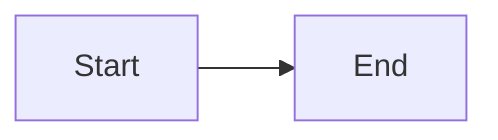
````

Renders as:


## Diagram Types

### Flowchart

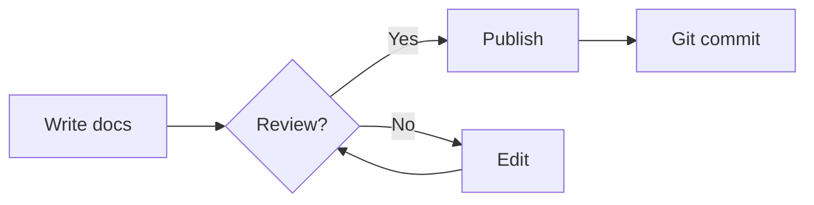

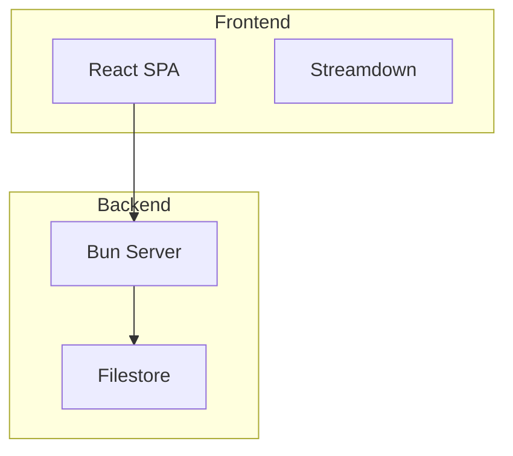

### Sequence Diagram

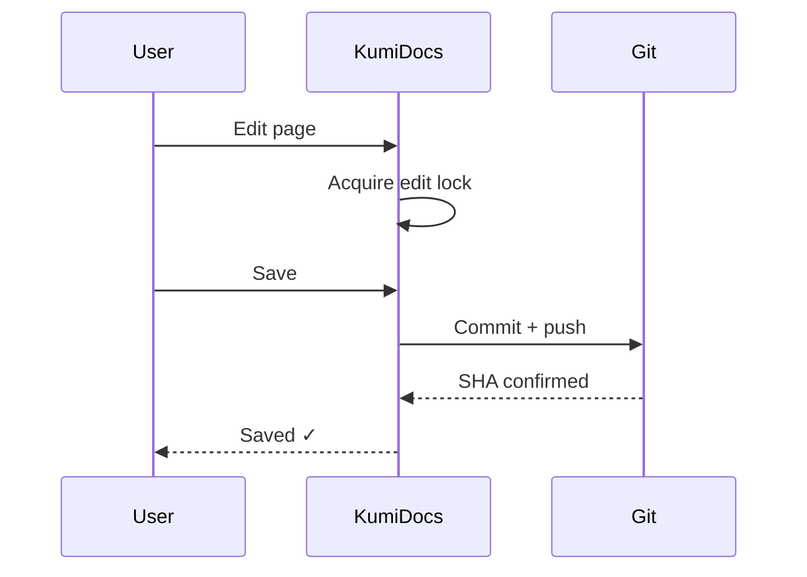

### Architecture Diagram (v11.1.0+)

Uses `architecture-beta` keyword with `group`, `service`, and edge `L/R/T/B` directions.

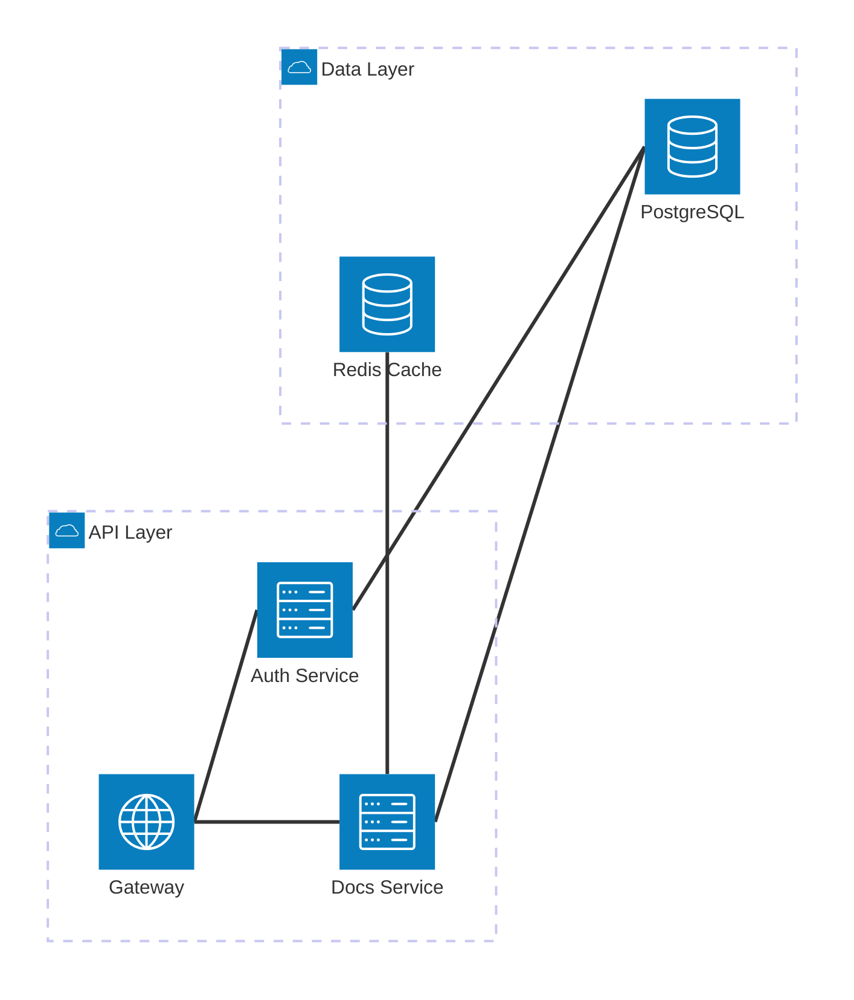

**Icons**: Use `logos:*` prefix for 200,000+ icons from Iconify:

```mermaid
architecture-beta
    group api(logos:aws-lambda)[API]
    service db(logos:aws-aurora)[Database] in api
    service server(logos:aws-ec2)[Server] in api
    db:R -- L:server
```

**Junctions** create split/merge points:

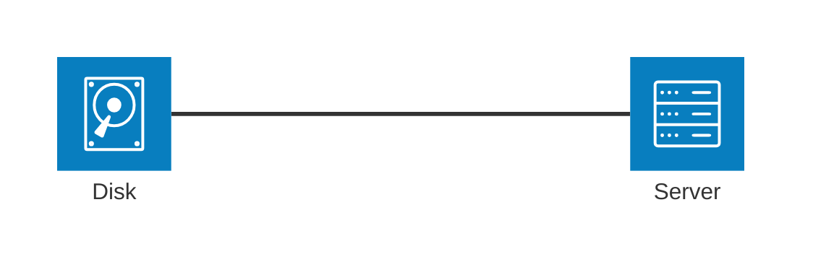

### Entity Relationship Diagram

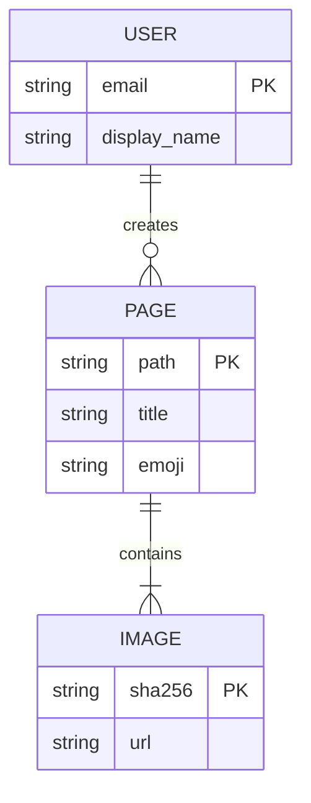

### Class Diagram

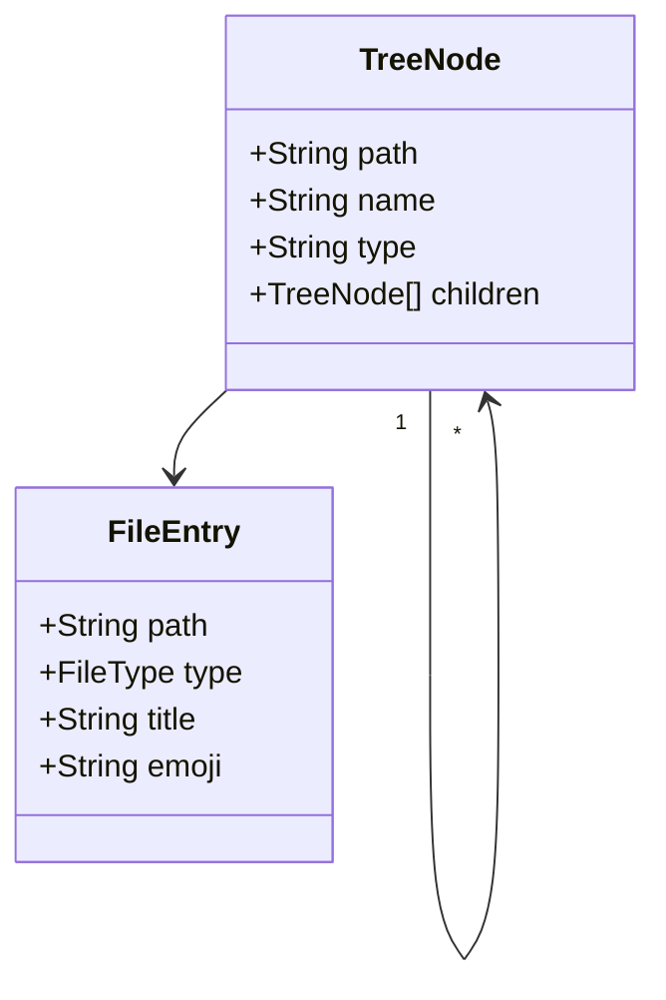

### State Diagram

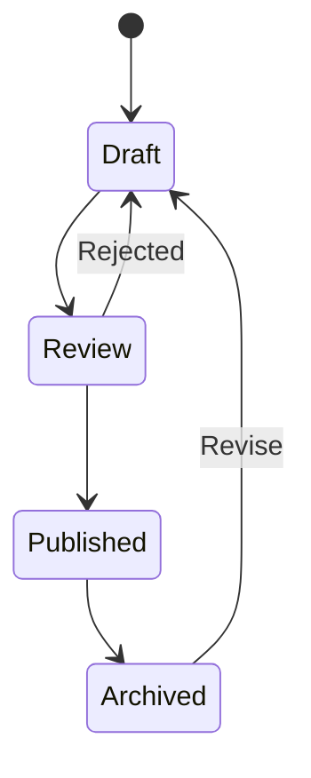

### Gantt Chart

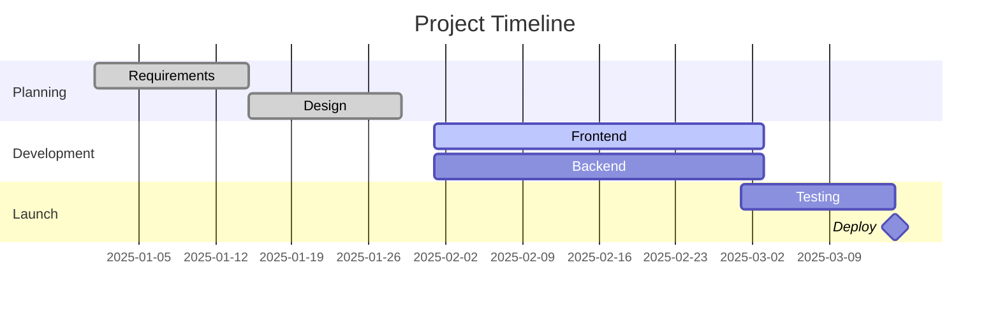

### Git Graph

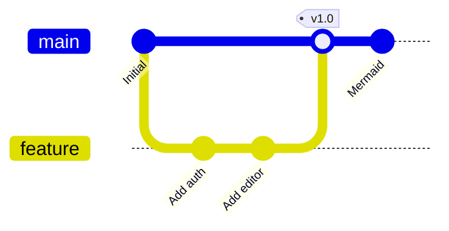

### Pie Chart

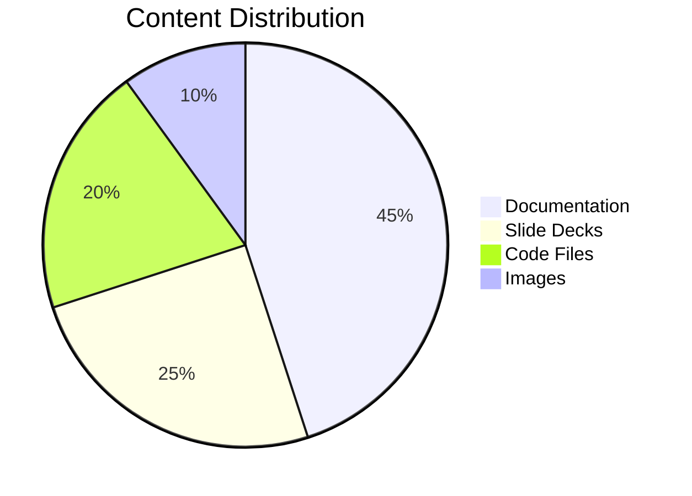

### Mindmap

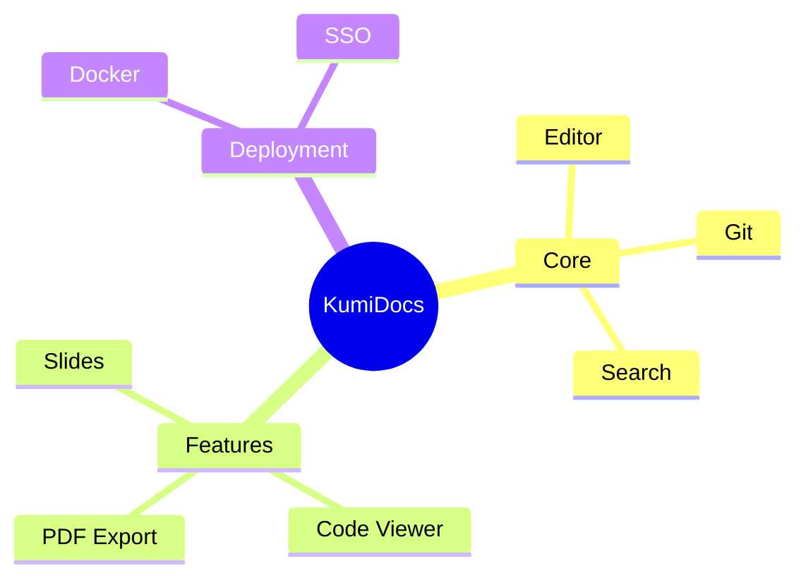

### Timeline

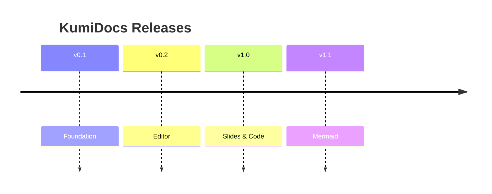

### XY Chart

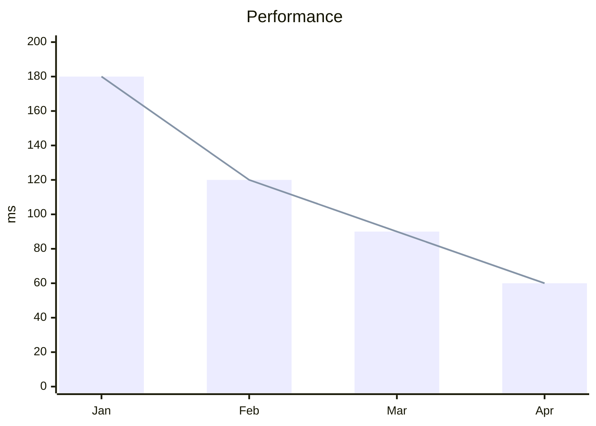

### User Journey

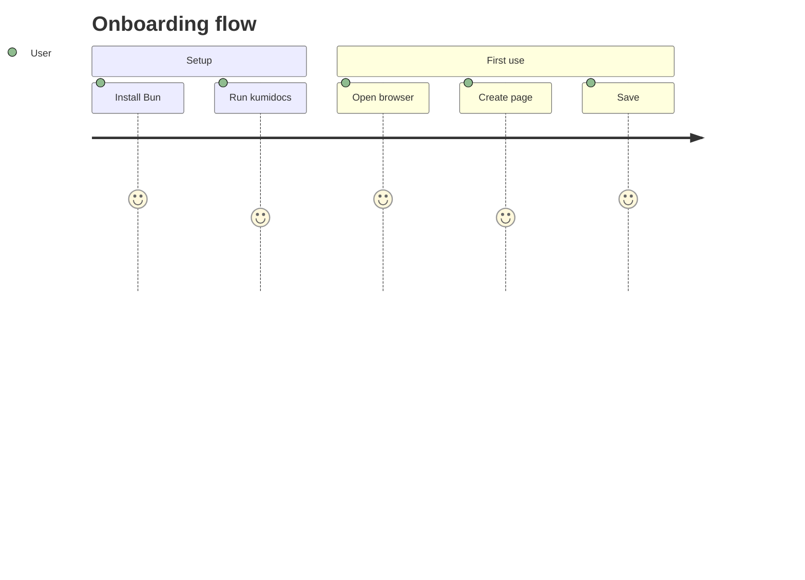

## Configuration

Mermaid can be configured via frontmatter directives:

````markdown
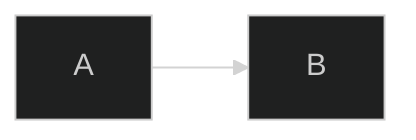
````

### Available themes

| Theme     | Description                       |
| --------- | --------------------------------- |
| `default` | Light theme                       |
| `dark`    | Dark theme                        |
| `forest`  | Green tones                       |
| `neutral` | Grey tones                        |
| `base`    | Fully custom via `themeVariables` |

## In Slide Decks

Mermaid diagrams work inside slide decks too:

````markdown
---
slides: true
theme: corporate
---

## Architecture

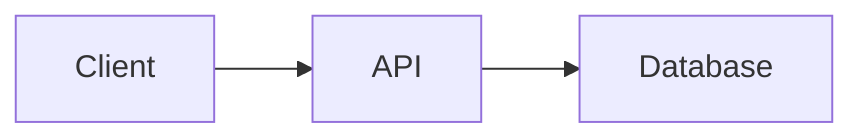
````

````

## Custom Icon Packs

Architecture diagrams support **icon packs** via the `prefix:icon-name` syntax. KumiDocs ships with **5 embedded icon packs** — no CDN required:

| Prefix | Pack | Example |
|--------|------|---------|
| `logos:*` | [Logos](https://github.com/gilbarbara/logos) | `logos:aws-s3`, `logos:github`, `logos:react` |
| `devicon:*` | [Devicon](https://devicon.dev) | `devicon:docker`, `devicon:postgresql` |
| `flag:*` | [Flag](https://github.com/iconify/icon-sets/tree/master/flag) | `flag:us`, `flag:gb-eng`, `flag:jp` |
| `fluent-color:*` | [Fluent Color](https://github.com/iconify/icon-sets/tree/master/fluent-color) | `fluent-color:cloud`, `fluent-color:database` |
| `glyphs-poly:*` | [Glyphs Poly](https://github.com/iconify/icon-sets/tree/master/glyphs-poly) | `glyphs-poly:server`, `glyphs-poly:shield` |

**Usage in architecture diagrams:**

```mermaid
architecture-beta
    group frontend(logos:react)[Frontend]
    group backend(logos:nodejs)[Backend]

    service spa(logos:typescript)[TypeScript] in frontend
    service api(logos:fastify)[API] in backend
    service db(devicon:postgresql)[PostgreSQL] in backend
    service cache(simple-icons:redis)[Redis] in backend

    spa:R -- L:api
    api:B -- T:db
    api:T -- B:cache
````

> Icons are bundled at build time — zero external network requests.

## Tips

- **Keep diagrams focused** — one concept per diagram
- **Use subgraphs** in flowcharts to group related nodes
- **Label edges clearly** with meaningful text
- **Architecture diagrams** benefit from icon prefixes for realistic service icons
- **Large diagrams** may take a moment to render — Mermaid runs entirely in the browser
